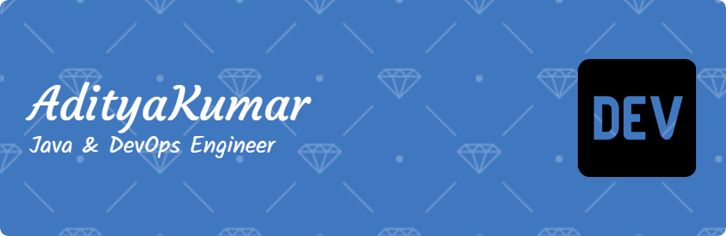

<!-- Animated Gradient Header -->

  

<h1 align="center">

</h1>

<h3 align="center">
🚀 Java Developer | ☁️ Cloud & DevOps Enthusiast | 🇮🇳 India
</h3>

---

# 🌐 My Digital Presence

---

# 🧠 About Me

- 🔭 **Solutions Engineer** building robust **banking & enterprise solutions**
- ☁️ Learning **AWS CI/CD (CodePipeline, EC2, S3, IAM, CloudWatch)**
- 🤝 Open to **Cloud / DevOps / Backend collaboration**
- ✍️ Writing technical blogs on **Hashnode**
- 🏸 Badminton | 🥾 Trekking | ⌨️ **60+ WPM Typist**

---

# 🚀 Featured Project

**DSA Self Prepare**

A modern **desktop application for Data Structures & Algorithm preparation** featuring:

- Multi-language **code runner**
- **AI powered hints**
- **Interview simulation**
- **Algorithm analytics dashboard**

---

# 📈 Live Contribution Activity

---

# 🧊 3D Contribution Calendar

---

# 🎮 Developer Fun (Games & Animations)

---

# 🛠️ Tech Stack

---

# 📊 GitHub Performance

  
  

  

---

# 🌍 Connect With Me

---

<!-- Footer Animation -->

